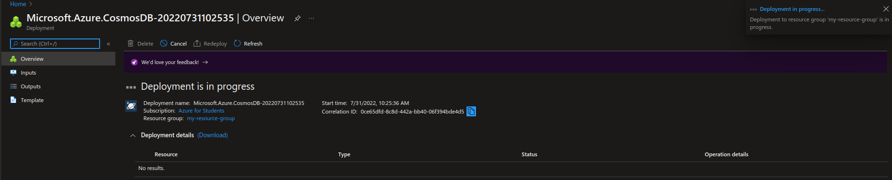

# Implementing a Cosmos database using the Azure Portal


---------------------------------------------------------


## Requirements
- Microsoft Azure Account ( with funds or credits    )
- Microsoft Azure Suscription
- A web browser
- Access to internet

---------------------------------------------------------

## Instructions
#### 1. Login to the [Azure Portal](https://portal.azure.com/).
#### 2. Once you're on the portal's home page, you will see something like this:

#### 3. Click on the searchbar at the top of the page and look for *Azure Cosmos DB* and click on it.

#### 4. Click *Create*.

#### 5. Click on *Create* inside the *Core (SQL)* box.

#### 6. Select your subscription and a resource group. In my case, I'll be creating a new resource group.

#### 7. Give your database a name and a region.

#### 8. If you want, you can further configure your database. In my case I'll be leaving everything as default. When you're finished, click *Review + create*.

#### 9. If validation passed, click *Create*.

#### 10. Deployment will begin. Please wait a couple of seconds.

#### 11. Once deployment has completed, clcik *GO to resource*.

#### 12. Click on *Quick start* and then *Node.js*.

#### 13. Click *Create 'items' container* and wait a couple of seconds.
#### 14. We will be working inside the browser, so click on *Open Data Explorer*.

#### 15. Click on Data/ToDoList/Items/Items .

#### 16. CLick on the *New item* button.

#### 17. Copy the following code and paste it inside the text box.
```JS
{
    "id": "123",
    "name": "Joseph",
    "age": 18,
    "isSleepy": true
}
```

#### 18. Click *Save*. You will see that some information has been added to the item, don't delete it; it's necessary for you DB to work properly.


#### 19. Create a new item by repeating steps 16 - 18, however, instead of using the code in step 17, use this one:
```JS
{
    "id": "456",
    "name": "Rose",
    "age": 19,
    "isHungry": true,
    "hasFreckles": true
}
```

#### 20. In order to retrieve information from your database, click on the *New SQL Query* button.

#### 21. You can then use SQL queries to retrieve your database's content. Here are a few examples:
```SQL
SELECT * FROM c
```

```SQL
SELECT * FROM c WHERE c.id = "123"
```

```SQL
SELECT c.isHungry FROM c WHERE c.name = "Rose"
```

---------------------------------------------------------

## Congratulations ! You've just created a fully functional Azure Cosmos DB !
Don't forget to delete or turn off your resources when you you're done with them !
